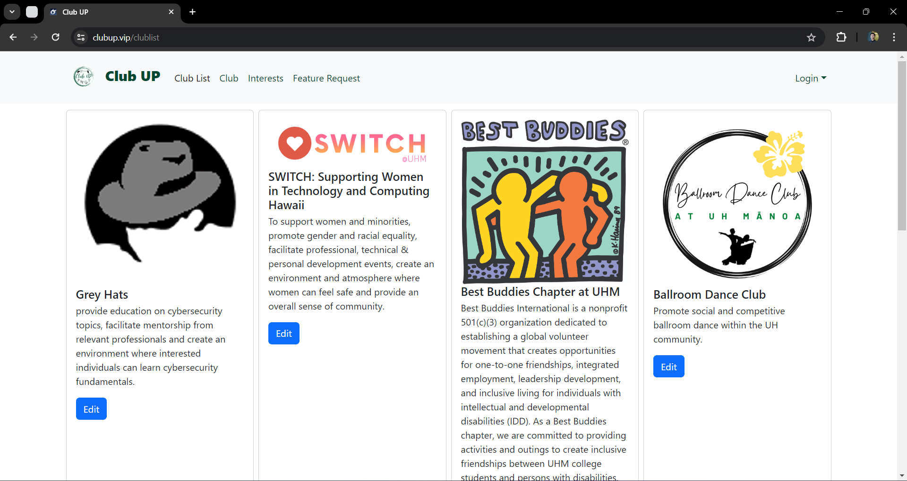
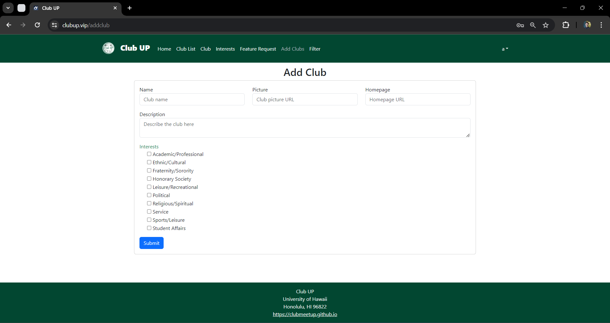
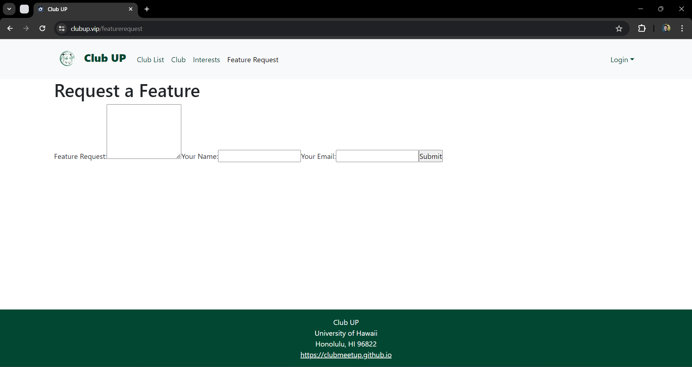

# Club Up

## Table of contents

* [Overview](#overview)
* [Deployment](#deployment)
* [User Guide](#user-guide)
* [Developer Guide](#developer-guide)
* [Team](#team)
* [Milestones](#milestones)

## Overview

*The problem*: UH Manoa has over 200 [Registered Independent Organizations](https://manoa.hawaii.edu/studentlife/involvement/registered-independent-organizations/), plus many more that do not have this “official” status but are nonetheless active organizations. Unfortunately, there is no easy way for students to learn (a) what student clubs (both registered and unregistered) exist, what they do, and how to get further involved.

*The solution*: The Club Up application will provide a centralized directory for UH Manoa student clubs. UH Manoa students can login to browse a well organized directory of all current student clubs, with brief descriptions, meeting times and locations, URLs to their websites (if any), contact information for officers, and a few select photos.

Club Up is a web application that provides pages to view and (in some cases) modify profiles, clubs, and interests. It utilizes several technological tools useful to ICS software engineering students, such as:

* [Meteor](https://www.meteor.com/) for Javascript-based implementation of client and server code.
* [React](https://reactjs.org/) for component-based UI implementation and routing.
* [React Bootstrap](https://react-bootstrap.github.io/) CSS Framework for UI design.
* [Uniforms](https://uniforms.tools/) for React and Semantic UI-based form design and display.

The systems also comes with code that makes use of different design concepts, such as:

* Three primary collections (Profiles, Clubs, Interests) as well as "join" Collections that implement relationships between them.
* Top-level index pages (Profiles, Clubs, and Interests) that show how to manipulate these collections in different ways.
* Authentication using the built-in Meteor accounts package along with Sign Up and Sign In pages.
* Authorization examples: certain pages are public (Profiles, Clubs, Interests), while other pages require login.

## Deployment

Club Up app can be reached [here](https://clubup.vip/).

## User Guide

This section gives a guide of the Club Up ui and its functions.

### Landing Page

The landing page is the first page that is shown to users when they visit the top-level URL to the site.

### Index pages (Clubs, Interests)

Club Up contains two public pages that show the contents of the database organized in multiple ways.

The Clubs page shows all the currently defined Clubs and their associated Interests:

The Interests page shows all the currently defined Interests, and their associated Clubs:

### Sign in and sign up

Click on the "Login" button in the top right corner of the navbar, then select "Sign in" to go to the following page and log in. You must have been previously registered with the system to be able to use this option:

On the other hand, you can select "Sign up" to go to the following page and register as a new user:

### Home page

After successfully logging in, you are led to the user home page, which is a form where you can complete and/or update your personal profile:

### Add Club page

Once you have logged in, you are able to define new clubs with the Add Club page:

### Filter page

This is a mockup of the Filter page. Once it has been implemented, it will allow you to query the database and display the results in the page. In this instance, the query will show all of the Clubs that match one or more of the chosen Interest(s).

### Feature Request

This is a mockup of the Feature Request form. Once it has been implemented, if you have any features that you would like to see in this application, please take the time to fill out our form and let us know what you think.

## Developer Guide

This section gives instructions to developers who want to use this code as a basis for their own projects.

1. Setup Instructions: Visit the [Club Up application github page](https://github.com/clubmeetup/club-meetup-app/) to clone the repository and install any dependencies. Navigate to the project directory and run npm install if you are using Node.js.

2. Local Development: To run the server, execute meteor npm run start to launch the site locally. Ensure your development server supports live reloading to see changes in real time.

3. Code Structure: For directory layout,
   /public are static files like images and fonts.
   /components are reusable UI components.
   /pages are webpage files.
   Main files describe key files like index.html, app.js, etc.

4. Contribution Guidelines: Follow Coding Standards such as following specific style guides (e.g., ESLint for JavaScript). For Pull Requests, fork the repository, make changes, and submit a pull request. Use Issue Driven Project Management practices.

## Team

[Club Up](https://github.com/clubmeetup) is designed, implemented, and maintained by [Kendrick Gonzales](https://kendrick-g.github.io/), [Justin Corpuz](https://justkcorp.github.io/), [Yirui Wang](https://yiruiwang0518.github.io/), [Rocky Huang](https://rucny.github.io/), and [Jason Nguyen](https://jknguyen2003.github.io/).

[Club Up Team Contract](https://clubmeetup.github.io/Contract/)

## Milestones

[Milestone 1](https://github.com/orgs/clubmeetup/projects/1)

[Milestone 2](https://github.com/orgs/clubmeetup/projects/2/views/1)

[Milestone 3](https://github.com/orgs/clubmeetup/projects/4)
