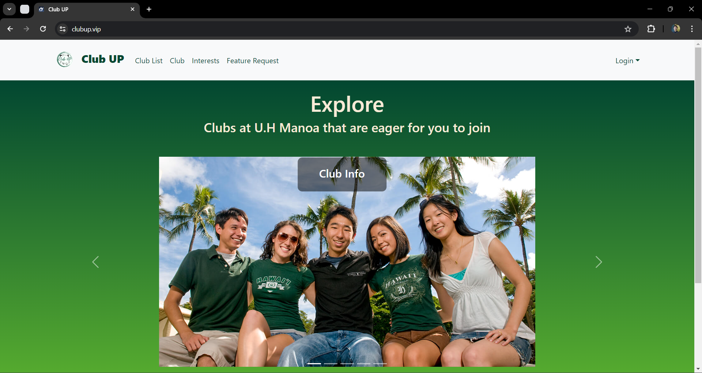
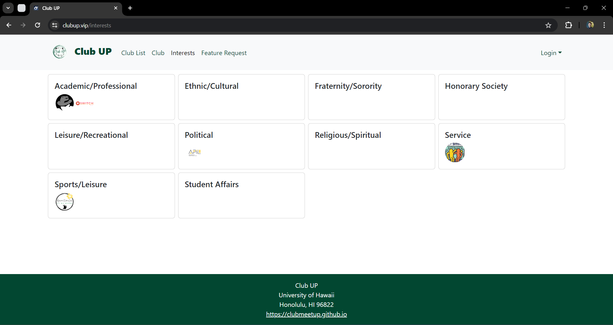
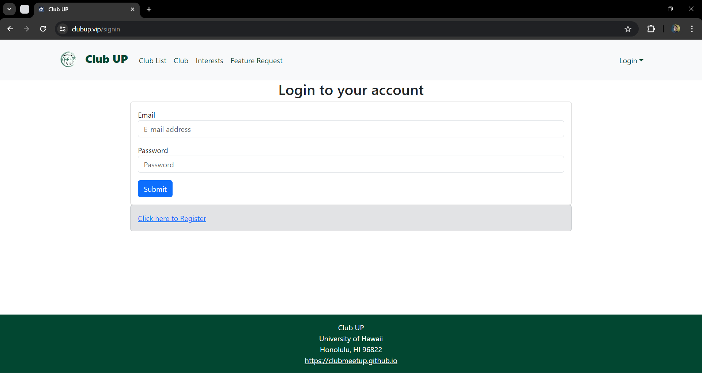
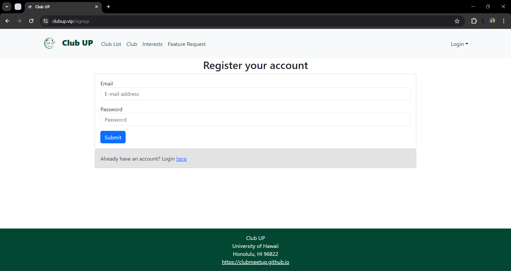
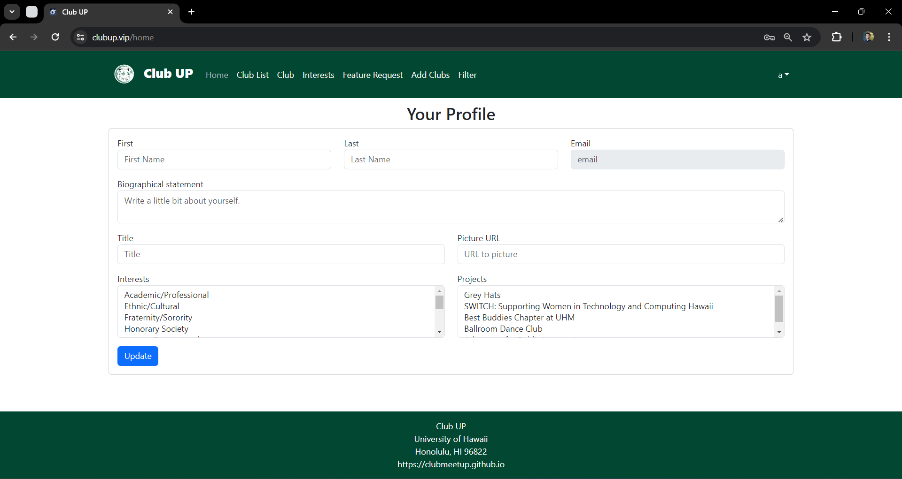
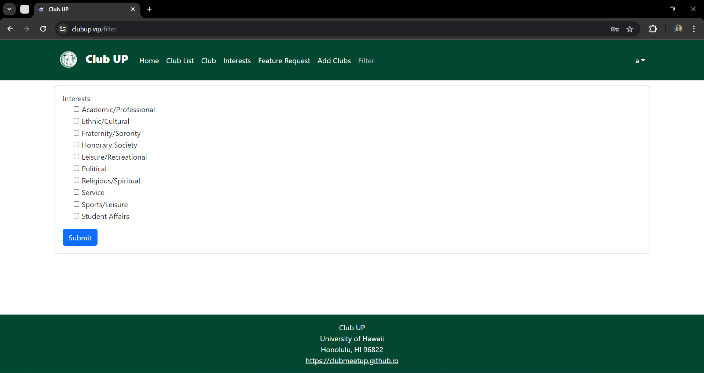

## Table of contents

* [Overview](#overview)
* [Deployment](#deployment)
* [User Guide](#user-guide)
* [Community Feedback](#community-feedback)
* [Developer Guide](#developer-guide)
* [Team](#team)
* [Milestone 1](#milestones)

## Overview

The problem: UH Manoa has over 200 Registered Independent Organizations, plus many more that do not have this “official” status but are nonetheless active organizations. Unfortunately, there is no easy way for students to learn (a) what student clubs (both registered and unregistered) exist, what they do, and how to get further involved.

The solution: The Club Meetup application will provide a centralized directory for UH Manoa student clubs. UH Manoa students can login to browse a well organized directory of all current student clubs, with brief descriptions, meeting times and locations, URLs to their websites (if any), contact information for officers, and a few select photos.

## Deployment

## User Guide

This section provides a walkthrough of the Club Up user interface and its capabilities.

### Landing Page

The landing page is presented to users when they visit the top-level URL to the site.



### Index pages (Clubs, Description, Contacts)

Club Up provides a list of available club activities to join at UH Manoa as well as points of contact students can reach out to for more information.

## UH Manoa Clubs/Activities

Check out the [list of clubs](https://clubmeetup.github.io/clublist/) available at UH Manoa

The Projects page shows all the currently defined Projects and their associated Profiles and Interests:


Finally, the Interests page shows all the currently defined Interests, and their associated Profiles and Projects:




### Sign in and sign up

Click on the "Login" button in the upper right corner of the navbar, then select "Sign in" to go to the following page and login. You must have been previously registered with the system to use this option:



Alternatively, you can select "Sign up" to go to the following page and register as a new user:



### Home page

After logging in, you are taken to the home page, which presents a form where you can complete and/or update your personal profile:



### Add Project page

Once you are logged in, you can define new projects with the Add Project page:


### Filter page

The Filter page provides the ability to query the database and display the results in the page. In this case, the query displays all of the Profiles that match one or more of the specified Interest(s).




## Developer Guide

This section provides information of interest to Meteor developers wishing to use this code base as a basis for their own development tasks.

### Installation

First, [install Meteor](https://www.meteor.com/install).

Second, visit the [Club Up application github page](https://github.com/), and click the "Use this template" button to create your own repository initialized with a copy of this application. Alternatively, you can download the sources as a zip file or make a fork of the repo.  However you do it, download a copy of the repo to your local computer.

Third, cd into the Club Up/app directory and install libraries with:

```
$ meteor npm install
```

Fourth, run the system with:

```
$ meteor npm run start
```

If all goes well, the application will appear at [http://localhost:3000](http://localhost:3000).

### Application Design

Club Up is based upon [meteor-application-template-react](https://ics-software-engineering.github.io/meteor-application-template-react/) and [meteor-example-form-react](https://ics-software-engineering.github.io/meteor-example-form-react/). Please use the videos and documentation at those sites to better acquaint yourself with the basic application design and form processing in Bowfolios.


## Initialization

The [config](https://github.com/bowfolios/bowfolios/tree/main/config) directory is intended to hold settings files.  The repository contains one file: [config/settings.development.json](https://github.com/bowfolios/bowfolios/blob/main/config/settings.development.json).

This file contains default definitions for Profiles, Projects, and Interests and the relationships between them. Consult the walkthrough video for more details.

The settings.development.json file contains a field called "loadAssetsFile". It is set to false, but if you change it to true, then the data in the file app/private/data.json will also be loaded.  The code to do this illustrates how to initialize a system when the initial data exceeds the size limitations for the settings file.


## Team

Club Up is designed, implemented, and maintained by [Kendrick Gonzales](https://kendrick-g.github.io/), [Justin Corpuz](https://justkcorp.github.io/), [Yirui Wang](https://yiruiwang0518.github.io/), [Rocky Huang](https://rucny.github.io/), [Jason Nguyen](https://jknguyen2003.github.io/)

## Team Contract

[Club Up Team Agreement](https://clubmeetup.github.io/Contract/)

## Milestones

[Milestone 1](https://github.com/orgs/clubmeetup/projects/1)