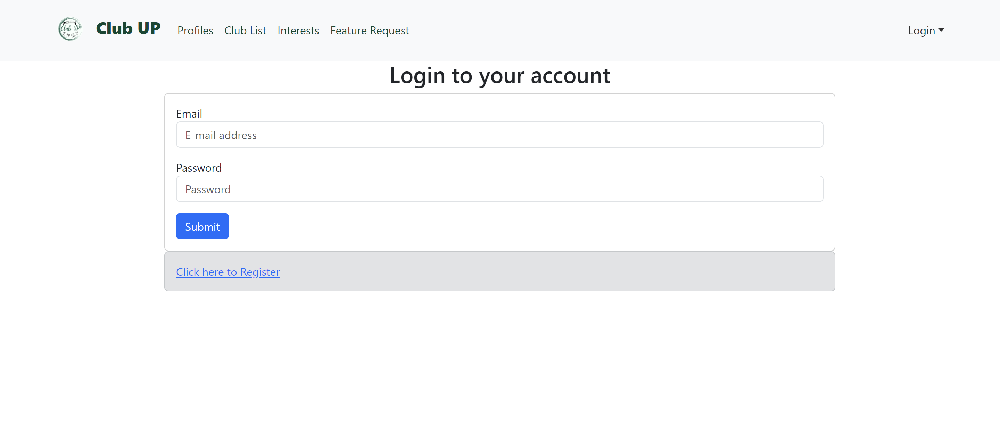
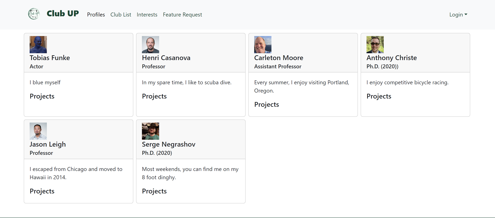
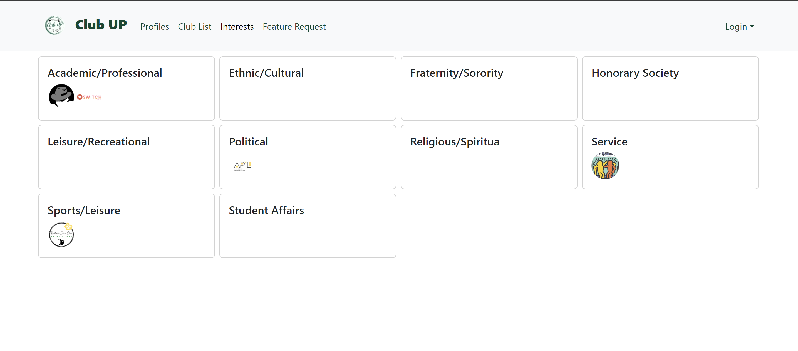
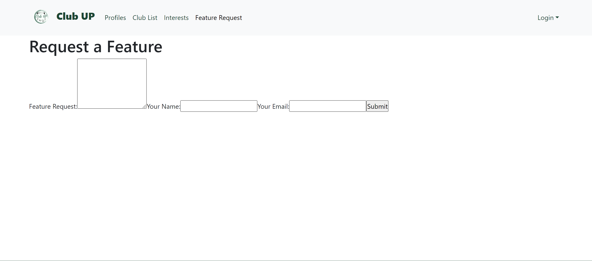

## Table of contents

* [Overview](#overview)
* [Deployment](#deployment)
* [User Guide](#user-guide)
* [Developer Guide](#developer-guide)
* [App Updates](#updates)
* [Team](#team)
* [Milestones](#milestones)

## Overview

The problem: UH Manoa has over 200 Registered Independent Organizations, plus many more that do not have this “official” status but are nonetheless active organizations. Unfortunately, there is no easy way for students to learn (a) what student clubs (both registered and unregistered) exist, what they do, and how to get further involved.

The solution: The Club Up application will provide a centralized directory for UH Manoa student clubs. UH Manoa students can login to browse a well organized directory of all current student clubs, with brief descriptions, meeting times and locations, URLs to their websites (if any), contact information for officers, and a few select photos.

## Deployment
Club Up app can be reached [here](https://clubup.vip/)

## Landing Page

Students will be able to login and browse through the clubs/activities available at UH Manoa. They will be able to have a tailored list of clubs/activities based on their interests. Students will be able to be notified of any updates made to the list of clubs available at UH Manoa as well as if any clubs they have joined have made any recent updates.

# Club List Page

Currently says Project page but, will be updated to be the Club List page

# Student Profile Page

Students can create their profile after signing onto the app.

# Interests Filter Page

Students will be given a tailored list of clubs based on their interests.

## UH Manoa Clubs Page

Club Up provides a list of available club activities to join at UH Manoa as well as points of contact students can reach out to for more information.

Check out the [list of clubs](https://clubmeetup.github.io/clublist/) available at UH Manoa

# User Guide

Login to your account or sign up if you haven't already.

You'll be able to view your profile to see what clubs you're currently in, view any club updates, as well as change interest preferences.

A list of clubs available at UH Manoa for students to browse

Enter your interests to tailor the list of clubs available for you to choose from

We have a Features Request page which allows students to submit any recommendations they feel would benefit all users of the application.

# Developer Guide
1. Setup Instructions: Clone the repository and install any dependencies. Navigate to the project directory and run npm install if you are using Node.js.

2. Local Development: To run the server, execute npm start to launch the site locally. Ensure your development server supports live reloading to see changes in real time.

3. Code Structure: For directory layout,
   /src contains all the source code.
   /public are static files like images and fonts.
   /components are reusable UI components.
   /pages are webpage files.
   Main files describe key files like index.html, app.js, etc.

4. Contribution Guidelines: Follow Coding Standards such as following specific style guides (e.g., ESLint for JavaScript). For Pull Requests, fork the repository, make changes, and submit a pull request. When there are issues reporting, report bugs or suggest enhancements via GitHub Issues.

5. Deployment: To build the project, run npm run build to create a production-ready build. For deploying, use services like GitHub Pages for deployment. Follow their specific instructions for deployment settings.

# Updates

### Club List Page

Students are able to browse the sorted list of clubs. Next update will include a filter option.

### App Feature Requests Page

Students are able to put in requests for possible convenient updates to the app.

### Interest Filter Page

Students will be given a specific list of clubs/activities based on their interests.

### Adding Clubs

Students will be able to add clubs to the app; providing information for the club.

## Team

Club Up is designed, implemented, and maintained by [Kendrick Gonzales](https://kendrick-g.github.io/), [Justin Corpuz](https://justkcorp.github.io/), [Yirui Wang](https://yiruiwang0518.github.io/), [Rocky Huang](https://rucny.github.io/), [Jason Nguyen](https://jknguyen2003.github.io/)

## Team Contract

[Club Up Team Agreement](https://clubmeetup.github.io/Contract/)

## Milestones

[Milestone 1](https://github.com/orgs/clubmeetup/projects/1)

[Milestone 2](https://github.com/orgs/clubmeetup/projects/2/views/1)
